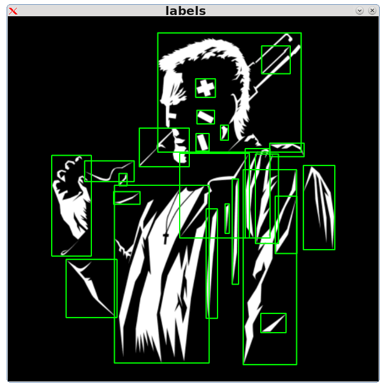

# Connected Components (with CUDA)
The connected components problem is common in image processing. FolkeV's [repository](https://github.com/FolkeV/CUDA_CCL) is an extension of original [Playne](https://github.com/DanielPlayne/playne-equivalence-algorithm)'s code with the Playne-Equivalence Connected-Component Labelling Algorithm described in:

D. P. Playne and K. Hawick,<br/>
"A New Algorithm for Parallel Connected-Component Labelling on GPUs,"<br/>
in IEEE Transactions on Parallel and Distributed Systems,<br/>
vol. 29, no. 6, pp. 1217-1230, 1 June 2018.<br/>
* URL: https://ieeexplore.ieee.org/document/8274991

&nbsp;&nbsp;&nbsp;&nbsp;


Here, the FolkeV's code was download in the CUDA_CCL folder to be used as library with some other features (area and coordinates extraction) very common in OpenCV C++ libraries but not available in cv::cuda classes to be exectued on the GPU.


## Usage

- [x] Declare ```cudalabel``` class object:
```
cudalabel labels;
```
- [ ] Set image from CPU:
```
labels.setimg(image);
```
- [x] Or, alternatively, set from GPU to avoid internal uploads, depending on your code needs:
```
labels.setgpuimg(gpuimage);
```
- [x] Step (2), preprocess (uses FolkeV's code in the CPU version).
```
labels.preprocess();
```
- [x] Step (3), internal call to the Playne&Hawick (2018) cuda code.
```
labels.labelize();
```
- [x] Step (4), new functions, get the labels coordinates (internal call to kernel ```kgetinfo```):
```
unsigned int** labelinfo;
labelinfo = labels.getinfo();
```
- [x] Release resources (required if work continues).
```
labels.reset();
```
- [ ] Optional (generate image and save results):
```
if (labels.imgen())
    labels.lsave(output_name);  
```

## Struct labels

The output ```unsigned int **infolables**``` as a double pointer, can be show as a 2D array where first column [0] has the id of the bounding box and positions [1-4] store the corner of the bounding box positions.

| labels |     id | x(0) | x(n) | y(0) | y(n) |
|--------|--------|------|------|------|------|
|      0 |  86758 |  741 |  873 |   84 |  216 |
|      1 | 133306 |  185 |  375 |  130 |  300 |


## Compilation
Download code and call ```cmake```.
```
$ git clone https://github.com/armengot/cudalabel
$ cd cudalabel
$ mkdir build
$ cd build
$ cmake ..
$ make
```

## CPU/GPU times
Using ```timing``` executable tool.
```
$ ./timing
```

Using the CPU image.
```
[CPU] processing image [2880x2160] with ../samples/sample0.jpg took 59 milliseconds.
[CPU] processing image [2880x2160] with ../samples/sample1.jpg took 61 milliseconds.
[CPU] processing image [2880x2160] with ../samples/sample2.jpg took 61 milliseconds.
[CPU] processing image [2880x2160] with ../samples/sample3.jpg took 61 milliseconds.
[CPU] processing image [2880x2160] with ../samples/sample4.jpg took 60 milliseconds.
[CPU] processing image [2880x2160] with ../samples/sample5.jpg took 62 milliseconds.
[CPU] processing image [2880x2160] with ../samples/sample6.jpg took 62 milliseconds.
[CPU] processing image [2880x2160] with ../samples/sample7.jpg took 62 milliseconds.
[CPU] processing image [2880x2160] with ../samples/sample8.jpg took 61 milliseconds.
[CPU] processing image [2880x2160] with ../samples/sample9.jpg took 62 milliseconds.
```
Uploading the image to the GPU.
```
[GPU] processing image [2880x2160] with ../samples/sample0.jpg took 129 milliseconds.
[GPU] processing image [2880x2160] with ../samples/sample1.jpg took 46  milliseconds.
[GPU] processing image [2880x2160] with ../samples/sample2.jpg took 45  milliseconds.
[GPU] processing image [2880x2160] with ../samples/sample3.jpg took 46  milliseconds.
[GPU] processing image [2880x2160] with ../samples/sample4.jpg took 47  milliseconds.
[GPU] processing image [2880x2160] with ../samples/sample5.jpg took 47  milliseconds.
[GPU] processing image [2880x2160] with ../samples/sample6.jpg took 51  milliseconds.
[GPU] processing image [2880x2160] with ../samples/sample7.jpg took 48  milliseconds.
[GPU] processing image [2880x2160] with ../samples/sample8.jpg took 47  milliseconds.
[GPU] processing image [2880x2160] with ../samples/sample9.jpg took 49  milliseconds.
```

## Test

Check the example binary ```main.cpp``` with any black and white posterized images:

```
$ ./cudalabel marv.png
```
Obtaining the bounding boxes:
```
[main] Image loaded   marv.png type: 24 channels number 4
[main] Image loaded   marv.png size: 882x867
[main] Image loaded   marv.png  min: 0 max: 255
[main] Image prepared marv.png type: 0 channels number 1
[main] Image prepared marv.png size: 882x867
[main] Image prepared marv.png  min: 0 max: 255
[main] Num of labels: 24 computed with threshold = 0
[main] LABEL[0] = [35058,356,697,39,322]
[main] LABEL[1] = [62407,603,671,70,136]
[main] LABEL[2] = [131001,446,493,148,192]
[main] LABEL[3] = [197142,449,491,223,255]
[main] LABEL[4] = [228067,505,524,258,294]
[main] LABEL[5] = [234119,312,431,265,357]
[main] LABEL[6] = [245656,447,478,278,320]
[main] LABEL[7] = [266135,622,704,301,333]
[main] LABEL[8] = [277558,564,623,314,526]
[main] LABEL[9] = [287223,408,574,325,526]
[main] LABEL[10] = [289042,588,643,327,539]
[main] LABEL[11] = [291228,104,198,330,569]
[main] LABEL[12] = [302823,182,300,343,392]
[main] LABEL[13] = [312948,702,777,354,554]
[main] LABEL[14] = [321730,559,686,364,827]
[main] LABEL[15] = [329266,264,283,373,402]
[main] LABEL[16] = [340997,533,548,386,636]
[main] LABEL[17] = [354147,253,478,401,823]
[main] LABEL[18] = [367225,251,314,416,446]
[main] LABEL[19] = [377300,635,687,427,563]
[main] LABEL[20] = [393013,516,526,445,515]
[main] LABEL[21] = [403571,471,498,457,717]
[main] LABEL[22] = [509053,138,259,577,715]
[main] LABEL[23] = [622469,601,661,705,751]
```
